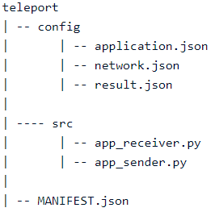

Application configuration
=========================

This section will describe what an application is and how to create and configure it. In QNE, an application functions
as a sort of 'template' to create your experiment for. You decide how many roles you want, what type of inputs and the
actual functionality of your application.

The creation and configuration of your application is split into three parts. First, you will create your application,
then you can follow the config and src pages to configure the contents of your application and make it ready for an
experiment.

Create application
------------------

Execute the command ``qne application create`` to create an application in your current directory. The
command documentation is:

.. code-block:: console

    qne application create [OPTIONS] APPLICATION_NAME ROLES...

    Arguments:
      APPLICATION_NAME The name of the application [required]
      ROLES            Names of the roles to be created [required]

This is an example of what this command could look like to create application named 'teleport' and
define 2 roles for it, 'Sender' and 'Receiver':

.. code-block:: console

    qne application create teleport Sender Receiver

You can add more than two roles as far as the network allows. If your network consists of five nodes, it is not
possible to create more than five roles. In `Network Information <network_information.html>`_ you can find the number
of nodes a network has. Your application will only work on networks that contains enough nodes for the number of roles
defined for the application.

After executing this command, you should have a directory structure that looks like this:

The ``config`` directory consists of json files to configure your application. ``application.json`` serves as a kind of
template for the inputs that the user can give to the application. The ``network.json`` contains the networks that are
available and the role names based on the roles that are given as input. The ``result.json`` is used as a kind of
template to display the results on the Quantum Internet Explorer website.

The src directory consists of a number of python files. These are the actual application files. For each role defined
in the application a python file is created. The file names of these application files are based on the role names you
specified while creating the application.

The file ``manifest.json`` contains metadata for the application as application name, description etc.

To make sure that your application has all the necessary and the correct structure, you can validate it with the
following command:

.. code-block:: console

    qne application validate teleport

You have now created your application and are ready to prepare the contents of the config and src files.

Config configuration
--------------------

After creating an application, a config directory is created within this application directory. This config directory
consists of the files application.json, network.json, and result.json. Each of these files is described below.

application.json
________________

The application.json file is used as a sort of 'template' for your application. It consists of inputs which will be
defined in a list inside the application.json file. The application.json contains a default layout after creating your
application. This layout looks like this (assuming two roles were used when creating an application):

.. literalinclude:: json_examples/application_conf_layout.json
  :language: JSON

Each role has its own input, with all roles being merged at the last input. This is the 'template' of your application
input. Each input value has a name, ``default_value``, ``minimum_value``, ``maximum_value``, ``unit``, and your
``default_value`` is a pi value, then the ``unit`` property of this input should have the value "rad". Each input can
also be scaled using the ``scale_value``, but only when the ``default_value`` is scalable. By default, the
``scale_value`` is 1.0, and no scaling will be done.

If ``scale_value`` is anything other than 1.0, then ``unit`` will need to be of a type where a scaling operation can be
performed upon the value. For example, if ``unit`` will be ‘rad' and the value is 3.14, then scaling can be something
else than 1.0, like 0.1. The value will now be multiplied with the scaling: 3.14 * 0.1 = 0.314

``input_type`` can take one of the following values:

1. number
2. qubit

An example of each type of ``input_type`` and its structure can be seen in the application config layout shown above.

You can also indicate which role or roles should be linked to which input by entering the role names in the "roles" list
property of each input.

Below is an example showing what an application.json file might look like in a State Teleportation application. The
roles are named Sender and Receiver when creating the application:

.. literalinclude:: json_examples/application_conf_example.json
  :language: JSON

network.json
____________

The network.json file states what networks a user can use to run their experiment on for this application. The networks
that will be available depend on the number of roles that have been given as input. If, for example, six roles are given
when creating the application, and the network 'europe' only consists of five nodes, this network can not be used and
will not be shown in the network.json file.

Furthermore, the role names should be listed in the list "roles". As soon as the application is created, the content
should be properly generated in network.json and there should be no need to modify anything in this file.

An example of the network.json file is shown below using the same inputs as given for the application.json:

.. literalinclude:: json_examples/network_conf_example.json
  :language: JSON

result.json
____________

The result.json file is also used as a 'template' file for displaying the results of an experiment on the frontend.
When the application is only meant to run locally, nothing will be displayed on the frontend and there
is no need to modify anything in this file.

Now that you learned a little more about how to edit your config files, it's time to start creating your src files

Src configuration
-----------------

When an application is created, a 'src' directory is also generated within the application directory. This src directory
contains your source files for writing the functionality of your application. These files are Python files and are named
after the names of your roles.

When writing these source files, you can use the functions from NetQASM to perform certain operations. The `NetQASM
documentation <https://netqasm.readthedocs.io/en/latest/quickstart/using-sdk.html>`_ provides all the information you
need on how to use NetQASM as an SDK and write your application source files.

Now that you have written your source files, you can run the following command to perform a few checks to see if
everything is in order in your application directory (This command needs to be performed in your application root
directory):

.. code-block:: console

    qne application validate

*Note: This command does not check the contents of your python files, only if the application structure is correct and
if the JSON files contain valid JSON.*

manifest.json
_____________

The file ``manifest.json`` contains metadata for the application as application name, description
and if the application need to run multiple times to come to an result. When the application is uploaded to
Quantum Network Explorer, this file also contains remote data to be able to link the local application to the remote
application.

The manifest.json is built up out of two parts, namely ``application`` and ``remote``.
The ``application`` is maintained by the developer.
The ``remote`` part of manifest.json is used by the ADK and only relevant when an application is uploaded to the
server. This part is not to be edited or maintained by the developer.

.. literalinclude:: json_examples/application_manifest_layout.json
  :language: JSON

An example of what the manifest could look like is as follows:

.. literalinclude:: json_examples/application_manifest_example.json
  :language: JSON

When the manifest and both the config and src directories are adjusted to your liking, and the application is validated,
it's time to create an experiment!
