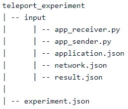

########################
Experiment configuration
########################

An experiment is built from the foundation of your application. So you could say that the application is a kind of
blueprint of your experiment. All inputs are described in the application, while with the experiments you can adjust
these inputs and make it ready for a run.

So you can create an experiment, adjust the values and run it. Then you can create another experiment for the same
application, but this time with different values. This way, you can compare different results with each other.

This section will help you step by step on how to create, configure and run an experiment.

*****************
Create experiment
*****************

In the experiment, you have the option to adjust the values of the inputs of the application for which you are creating
the experiment. To create an experiment, use the following command:

.. code-block:: console

    qne experiment create EXPERIMENT_NAME APPLICATION_NAME NETWORK_NAME

    Arguments:
      EXPERIMENT_NAME Name of the experiment. [required]
      APPLICATION_NAME Name of the application. [required]
      NETWORK_NAME Name of the network to be used. [required]

In section `Network Information <network_information.html>`_ you can find all details about each network. Based on this
information you can choose which network to use for your experiment.

Assuming your application name is 'teleport', this could be an example of what this command can look like:

.. code-block:: console

    qne experiment create teleport_experiment teleport randstad

*Note: This command can be executed anywhere on your computer. You don't have to create it in your application
directory.*

After executing this command, a directory is generated named after your experiment name. Within this directory, an
experiment.json file is created along with an input directory. This input directory contains all the JSON together with
the application source files, copied over from your application directory. Now you should have the following experiment
directory structure:

Since the input directory is a direct copy from your application directory, you don't have to change anything in here.
The experiment.json is where the action takes place. So now that the creation of your experiment structure is ready,
you can start to configure your experiment.

********************
Configure experiment
********************

After creating your experiment, you should have an experiment directory containing all necessary files. If you haven't
created an experiment yet, first go to Create experiment. This section describes what the experiment.json file consists
of and how it can be modified to make it ready for a run.

Experiment.json configuration
=============================

In experiment.json you can adjust which network and which nodes/channels you use. In addition, you can adjust the values
you entered as inputs when configuring your application. The experiment.json file is built up out of two parts, namely:
the ``meta`` and ``asset``.

Meta
----

The ``meta`` attribute contains the attributes that describe the runtime configuration. This entails the application
for which this experiment is created, the backend on which the experiment is run,
a short description of the experiment, how many times to run, and the name of the experiment:

.. literalinclude:: json_examples/experiment_meta_layout.json
  :language: JSON

An example of what the meta could look like is as follows:

.. literalinclude:: json_examples/experiment_meta_example.json
  :language: JSON

Asset
-----

The asset contains the user input for the configuration of both the network and the application. The asset is built up
out of a ``network`` and ``application`` property. The ``network`` property contains all information about the nodes and
channels which are available for this network. The ``application`` property describes all inputs of the application,
what role(s) is/are linked to this input, and what value it stores.

Network
^^^^^^^

The network property contains a ``name``, ``slug``, and ``roles`` and is built up out of multiple ``nodes`` and
``channels``. Depending on what network has been chosen to run the experiment on, the values of the ``name``, ``slug``,
``node`` and ``channels`` have already been generated and should be left as it is. In the ``roles`` property, you can
link your role names to a node belonging to the network.

Each channel has its own template, containing the properties ``name``, ``node1``, ``node2``, and ``parameters``. All
channels belonging to this network are listed, each having the correct slug and node names. So you don't have to change
any of these values. You can tweak the 'parameter' values by setting the ``value`` property and ``scale_value`` to your
liking. Below, an example is given of what a single channel looks like:

.. literalinclude:: json_examples/experiment_channel_example.json
  :language: JSON

In addition, a node also consists of a kind of template in which it consists of a ``name``, ``slug``, ``coordinates``,
``node_parameters``, and a list of ``qubits``. Again, none of these values have to be changed. However, you can change
the ``value`` and ``scale_value`` of the node_parameters to your liking, as well as the ``value`` and ``scale_value``
of the qubits. Below, an example of a single node is given:

.. literalinclude:: json_examples/experiment_node_example.json
  :language: JSON

All channels and nodes belonging to the chosen network are automatically generated. So no channels or nodes need to be
added or deleted.

Finally, a network also has the property ``roles``, which is a dictionary where you can link your role names to any
desired node slug. For example:

.. literalinclude:: json_examples/experiment_roles_example.json
  :language: JSON

*Note: make sure that each role has its own node. For example, in the example above, 'Sender' and 'Receiver' cannot
both be paired with 'amsterdam'.*

Application
^^^^^^^^^^^

The asset also has an ``application`` property which is a list of all the inputs of your application. Each input
consists of a ``roles`` and ``values`` dictionary. Here you can assign roles to inputs and give it a certain value. An
example of a single input looks like this:

.. literalinclude:: json_examples/experiment_application_example.json
  :language: JSON

You can validate your experiment by using the command (assuming you are in your experiment root directory). This checks
that all necessary files are present and that the structure of experiment.json is correct.

.. code-block:: console

    qne experiment validate

*******
Example
*******

A complete example of what the experiment.json could look like is given below:

.. literalinclude:: json_examples/experiment_complete_example.json
  :language: JSON
